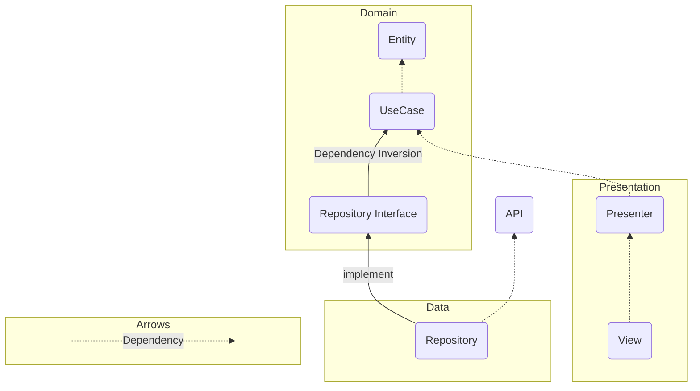

# アーキテクチャ
クリーンアーキテクチャを基にしてアーキテクチャを作成

クリーンアーキテクチャの図どおりにする必要はなさそうです

参考サイト↓
- [世界一わかりやすいClean Architecture](https://www.nuits.jp/entry/easiest-clean-architecture-2019-09)
- [ドメイン駆動設計＋クリーンアーキテクチャ解説](https://qiita.com/koh789/items/87ecb9e59c35b33e9c09)

--- 

このアプリのビジネスルールを次のように定める
- 天気情報APIへリクエストを正しく送信することができる
- 天気情報APIからのレスポンスを正しく解釈することができる
- 取得した天気情報をユーザーに表示することができる
（表示に関する処理なのでUseCaseには含めない）

> ビジネスルール：
> 
> ビジネスルールとはシステムが満たすべきビジネス上の制約や要件を表すルールです。
> ビジネスルールは、ユースケースクラスの制約条件や事後条件として記述されます。

> ビジネスロジック：
>
> ビジネスロジックは、ビジネスルールを具体的なプログラムにおける処理の内容、手順、方法に変換したものです。
> ビジネスロジックは、システムの動作や振る舞いを表し、コアなルールや処理の流れとして実装されます。

ビジネスロジックを定義する箇所（Domain）に他の箇所が依存するようにして、Domainの安定度を高め、他の箇所の柔軟性を高めるように設計

---

## Domain

Entity：天気に関するオブジェクトを定義

UseCase：ビジネスロジック（表示に関する処理を除く）
- APIを使ってリクエストを送る
- APIからレスポンスを受け取る

Repository Interface：UseCaseで扱うリポジトリのインターフェース
- Domain内に記述することでRepositoryの実装がDomainに依存するようになる（依存性逆転の原則）

---

## Data
Repository: 外部APIとDomainの間を持つ

API：アプリケーション外部のAPI

---
## Presentation
Presenter：
Viewで表示するデータを扱ったり、ViewからUseCaseを扱えるように間を持つ

View：WidgetなどによりUIを構築する